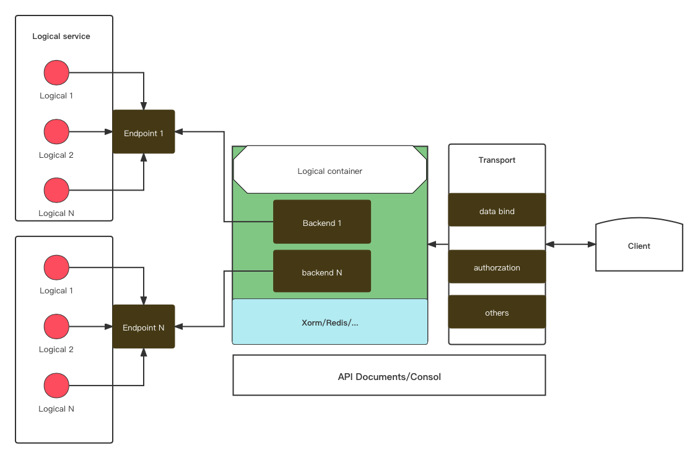
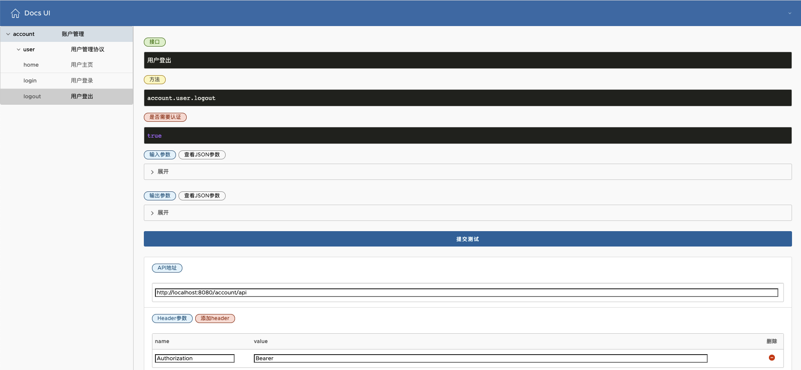

#Involution 微服务开发套件

##支持的功能列表
* 支持本地配置启动不使用微服务环境， --config本地配置不会注册微服务
* 可选支持微服务注册,微服务调用支持断路器 参考microservice.go init方法
* 集成内置文档和接口测试（参考example/services/account/views）
* 支持pprof
* 支持newrelic的标准web事务监控
* 集成组件列表(不满足需求的在framework/backend.go里增加)
* 接口验证支持jwt和token，参考authorities
* 接口支持数据签名 参考transport
##依赖组件
* 注册中心 [consul]([https://www.consul.io])
* 建模工具 [reverse](https://gitea.com/xorm/reverse)
* 微服务客户端 [mirco](https://github.com/go-various/micro)
* redis客户端 [redisplus](https://github.com/go-various/redisplus)
* 数据库orm [xorm](https://github.com/go-various/xormplus)

##配置
* 配置文件 [config/config.hcl](config/config.hcl)

##启动参数
<pre>
cd src/example 
go run main.go --help 
Usage:
  main [OPTIONS]

Application Options:
      --app=                                            App name for service
      --profile=                                        Profile for runtime
      --config=                                         Config file for runtime
      --pprof                                           Enable profiling
      --pprof.port=                                     Listen port on Pprof server (default: 127.0.0.1:32768)
      --ui                                              Enable document ui support
      --newrelic                                        Enable newrelic support
      --newrelic.key=                                   Key for newrelic access
      --newrelic.trace                                  Trace on newrelic access

log:
      --log.console                                     Set log output to console
      --log.path=                                       Sets the path to log file (default: logs)
      --log.level=[info|warn|error|debug|trace]         Sets the log level (default: info)
      --log.format=[text|json]                          Sets the log format (default: text)

consul:
      --consul.dc=                                      Datacenter for consul cluster
      --consul.address=                                 Sets the consul address
      --consul.acl_token=                               Token for consul config read
      --consul.config_key=                              Key for consul config read
      --consul.config_format=[hcl|yaml|json|properties] Format for config content (default: hcl)

http:
      --http.path=                                      Path for http server context
      --http.address=                                   Address for http server listening (default: 0.0.0.0)
      --http.port=                                      Port for http server listening (default: 8080)
      --http.cors                                       Support Cors access
      --http.trace                                      Trace http requests
      --http.sign                                       Sign verification requests
      --http.idle=                                      Timeout(seconds) for idle connection (default: 30)
      --http.read=                                      Timeout(seconds) for read  client request (default: 5)
      --http.write=                                     Timeout(seconds) for write to client request (default: 10)

Help Options:
  -h, --help                                            Show this help message

</pre>

## 开发参考
* 可以参考example目录
```

func main() {
	log.SetFlags(log.Lshortfile | log.LstdFlags)

	opts, err := option.NewOptions()
	if err != nil {
		os.Exit(1)
	}

	factories := map[string]logical.Factory{
		"account": controller.Factory,
	}

	inv, err := involution.DefaultInvolution(opts, factories)

	if err != nil {
		log.Fatal(err)
		return
	}

	if err := inv.Start(); err != nil {
		log.Fatal(err)
		return
	}
}
```
##设计模型

##接口文档和api测试预览

